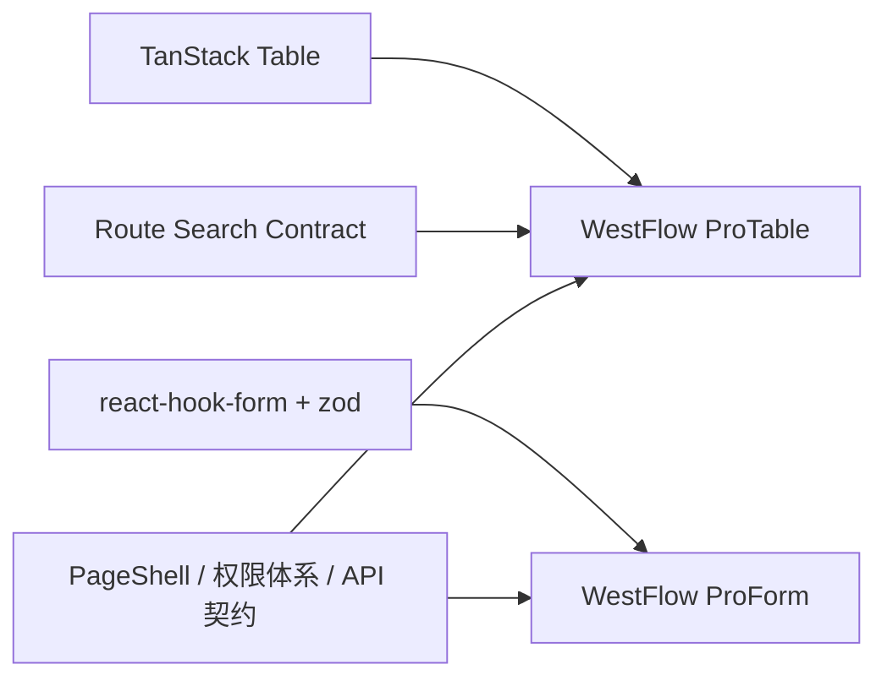

# WestFlow ProTable / ProForm Design

**Date:** 2026-03-25

**Scope:** 统一后台列表与表单交互基线，首批覆盖组织管理与 OA 业务列表。

---

## 背景

当前前端已经有可复用的列表骨架 [resource-list-page.tsx](/Users/west/dev/code/west/west-flow-ai/frontend/src/features/shared/crud/resource-list-page.tsx)，但它只统一了搜索、列设置、表头排序和分页。各业务页面在“刷新、筛选、导入导出、批量操作、看板模式、表单布局”上仍然是分散实现或尚未实现，导致：

- 组织管理页和 OA 业务页交互不一致
- 默认列表工具栏能力不足
- 导入导出没有统一入口
- `groups` 等协议已经预留，但前端并没有统一可用的交互抽象
- 表单页仍然以“页面级表单”为主，没有沉淀成一套业务壳组件

目标不是引入第三方 `ProTable/ProForm`，而是在现有 `TanStack Table + react-hook-form + zod + PageShell` 基线之上，封装一套项目内统一能力。

---

## 设计目标

1. 统一列表页交互基线
2. 支持后台管理型表格与业务型表格两类场景
3. 首批快速接入组织管理和 OA
4. 不推翻现有 URL 查询态、权限体系、API 契约
5. 只暴露真正可用的能力，不展示“协议预留但不可用”的半成品入口

---

## 非目标

本阶段明确不做：

- 第三方 Ant Design ProTable / ProForm 集成
- 真分组展示
- 保存视图
- 列拖拽与列宽拖拽
- 固定列
- 日历视图 / 时间轴视图
- OA 业务单据导入

这些能力保留后续扩展空间，但不纳入首批交付。

---

## 总体方案

采用“基础层不变，业务壳层新增”的方式：

- 基础层继续使用：
  - `TanStack Table`
  - `react-hook-form`
  - `zod`
  - 当前路由搜索态
  - 当前 API 分页契约
- 业务壳层新增：
  - `ProTable`
  - `ProForm`

关系如下：

---

## ProTable 设计

### 1. 组件定位

`ProTable` 是统一的数据展示工作台，不只是表格容器。它负责：

- 查询状态
- 工具栏
- 表格视图
- 看板视图
- 导入导出动作
- 批量操作入口

首批支持两种视图：

- `table`
- `board`

其中：

- 组织管理：只启用 `table`
- OA：启用 `table + board`

### 2. 默认基线能力

所有接入 `ProTable` 的页面默认具备：

- 刷新
- 搜索
- 表头排序
- 筛选抽屉
- 列设置
- 密度切换
- 导出

### 3. 可选增强能力

按页面配置开启：

- 导入
- 批量选择
- 批量操作
- 看板模式
- 行展开

### 4. 工具栏布局

采用数据密集型后台布局：

- 左侧：
  - 总数
  - 最近刷新时间
- 中间：
  - 搜索
  - 筛选
  - 排序摘要
  - 密度切换
- 右侧：
  - 刷新
  - 导出
  - 导入（按页面开启）
  - 新建
  - 视图切换（按页面开启）

### 5. 查询模型

继续复用现有 `ListQuerySearch`：

- `page`
- `pageSize`
- `keyword`
- `filters`
- `sorts`
- `groups`

但 UI 行为改为：

- `groups` 暂不显示入口
- `sorts` 主要来源于表头排序和排序摘要
- `filters` 统一进入筛选面板

### 6. 导出能力

统一导出入口，支持：

- 当前页
- 当前筛选结果
- 已选行

后端未接实时导出前，前端可以先统一协议和交互。

### 7. 导入能力

仅组织管理首批开启，入口行为统一为：

- 下载模板
- 上传文件
- 本地/服务端校验预览
- 展示错误行
- 确认导入

---

## 看板模式设计

看板模式只用于业务型页面，首批是 OA。

### OA 看板分列

按状态分列：

- 草稿
- 审批中
- 已通过
- 已驳回
- 已撤销

### 卡片内容

每张卡片展示：

- 标题
- 单号
- 发起人
- 当前节点
- 创建时间
- 快捷操作

### 与表格模式关系

看板和表格共享：

- 搜索
- 筛选
- 刷新
- 导出

只有这些能力因模式变化而不同：

- 列设置：仅表格模式显示
- 密度切换：仅表格模式显示
- 批量操作：首批仅表格模式支持

---

## ProForm 设计

### 1. 组件定位

`ProForm` 不是替换 `react-hook-form`，而是统一业务表单壳层。

负责：

- 表单栅格
- 字段分组
- 提交区
- 只读态
- 错误提示风格
- 业务选择器包装

### 2. 首批统一能力

- 一致的分组标题
- 一致的 label / help / error 风格
- 一致的提交区布局
- 两栏/单栏响应式布局

### 3. 首批接入范围

- 组织管理编辑页
- OA 发起表单

### 4. 后续可扩展

- 选人组件包装
- 选部门/选角色包装
- 上传组件包装
- 审批类只读详情表单壳

---

## 首批页面接入

### 组织管理

首批接入页面：

- 用户管理
- 公司管理
- 部门管理
- 岗位管理
- 角色管理

能力开启：

- `table`
- 刷新
- 搜索
- 状态筛选
- 排序
- 列设置
- 密度
- 导出
- 导入

### OA

首批接入页面：

- 请假列表
- 报销列表
- 通用申请列表
- OA 查询

能力开启：

- `table + board`
- 刷新
- 搜索
- 状态筛选
- 时间范围筛选
- 排序
- 列设置
- 密度
- 导出

不启用：

- 导入

---

## 组件结构建议

### ProTable

- `frontend/src/features/shared/pro-table/pro-table.tsx`
- `frontend/src/features/shared/pro-table/pro-table-toolbar.tsx`
- `frontend/src/features/shared/pro-table/pro-table-filters.tsx`
- `frontend/src/features/shared/pro-table/pro-table-refresh.tsx`
- `frontend/src/features/shared/pro-table/pro-table-density.tsx`
- `frontend/src/features/shared/pro-table/pro-table-export.tsx`
- `frontend/src/features/shared/pro-table/pro-table-import.tsx`
- `frontend/src/features/shared/pro-table/pro-table-board.tsx`

### ProForm

- `frontend/src/features/shared/pro-form/pro-form-shell.tsx`
- `frontend/src/features/shared/pro-form/pro-form-section.tsx`
- `frontend/src/features/shared/pro-form/pro-form-actions.tsx`

---

## 迁移策略

### 第一阶段

在保留 [resource-list-page.tsx](/Users/west/dev/code/west/west-flow-ai/frontend/src/features/shared/crud/resource-list-page.tsx) 的情况下新增 `ProTable`，避免一次性替换所有页面。

### 第二阶段

组织管理列表切到 `ProTable`。

### 第三阶段

OA 列表切到 `ProTable`，并启用 `board`。

### 第四阶段

组织管理编辑页和 OA 发起页逐步切到 `ProForm`。

---

## 风险与控制

### 风险 1：范围膨胀

解决：

- 首批不做真分组
- 首批不做保存视图
- 首批不做列拖拽

### 风险 2：页面差异过大

解决：

- 只统一基线能力
- 导入、看板、批量操作全部按页面开关配置

### 风险 3：URL 状态与表格状态不一致

解决：

- 继续沿用现有 `ListQuerySearch`
- `ProTable` 只负责收口状态映射，不自建第二套查询协议

---

## 验收标准

满足以下条件可视为首批完成：

1. 组织管理首批页面统一切到 `ProTable`
2. OA 首批列表统一切到 `ProTable`
3. OA 列表支持 `table / board` 切换
4. 所有首批页面具备统一刷新、筛选、导出、列设置、密度能力
5. 组织管理表单和 OA 发起表单至少有一批页面切到 `ProForm`
6. 默认 URL 不残留无意义查询参数

